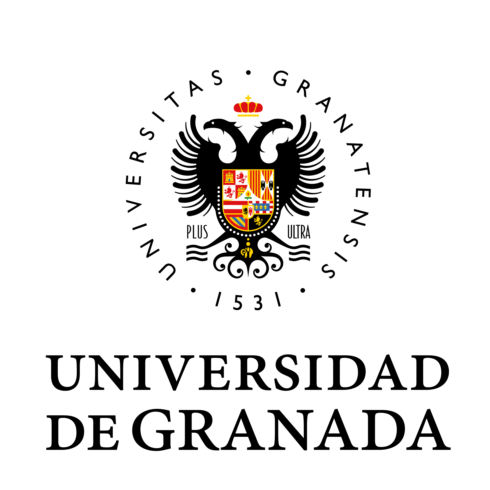

## El Grupo {.section-title}

**BIO³ BIOCUBO** es un grupo de investigación interdisciplinar radicado en la [Universidad de Granada](https://www.ugr.es) que reúne a matemáticos del grupo FQM-0316, estadísticos, Bioestadísticos del grupo FQM-235, epidemiólogos y otros perfiles cuantitativos con un objetivo común: aplicar métodos rigurosos al avance de las biociencias, la epidemiología y la salud pública.

El nombre **BIO³** expresa la idea de elevar la biociencia al cubo, multiplicando su potencial a través de la intersección de tres dimensiones cuantitativas:

$$\text{BIO}^3 = \text{Bioinformática} \times \text{Bioestad\'istica} \times \text{Biomatemáticas}$$

Creemos que las preguntas científicas más importantes requieren perspectivas múltiples. Un epidemiólogo trabajando solo, un matemático sin aplicaciones reales, están incompletos. Juntos, hacemos mejor ciencia.

------------------------------------------------------------------------

## Líneas de Investigación {.section-title}

-   **Inferencia causal:** métodos semiparamétricos, *targeted learning*, causalidad conformal
-   **Modelos matemáticos:** dinámica de enfermedades infecciosas, modelos poblacionales
-   **Estadística computacional:** métodos de Monte Carlo, inferencia bayesiana, *machine learning*
-   **Bioinformática y ómicas:** análisis genómico, transcriptómico y proteómico
-   **Epidemiología cuantitativa:** farmacoepidemiología, estudios observacionales, grandes bases de datos
-   **Bioestadística clínica:** ensayos clínicos, datos longitudinales, análisis de supervivencia
-   **Biomatemáticas:** Ecuaciones de Transporte, Mecánica de Fluidos, Ecuaciones Estocásticas, Modelización génica. Matemáticas y ciencias de la vida: modelos de desarrollo.

------------------------------------------------------------------------

## Cómo Colaborar {.section-title}

BIO³ está abierto a:

-   **Investigadores de la UGR** de cualquier departamento con interés en métodos cuantitativos
-   **Investigadores externos** que quieran colaborar o impartir un seminario
-   **Estudiantes de grado, máster y doctorado** interesados en formación cuantitativa avanzada
-   **Clínicos y profesionales de la salud** que busquen apoyo metodológico

Para unirte o colaborar con el grupo, contacta con el coordinador a través del [portal de la Universidad de Granada](https://www.ugr.es).

------------------------------------------------------------------------

## Afiliación Institucional {.section-title}

::: logo-row
[{width="180px" alt="Escudo de la Universidad de Granada"}](https://www.ugr.es)

{width="180px" alt="Logotipo de BIO³ BIOCUBO"}
:::

BIO³ BIOCUBO está vinculado a la **Universidad de Granada** y opera en colaboración con:

-   Facultad de Medicina
-   Facultad de Ciencias (Departamentos de Estadística y Matemática Aplicada)
-   Escuela Andaluza de Salud Pública (EASP)
-   Instituto de Investigación Biosanitaria de Granada (ibs.GRANADA)

------------------------------------------------------------------------

## Contacto {.section-title}

::: contact-grid
::: contact-item
**Coordinadores**

Juan Manuel Melchor Rodríguez · Miguel Ángel Montero Alonso · Miguel Ángel Luque-Fernández · Oscar Sánchez · Juan Calvo
:::

::: contact-item
**Institución**

Universidad de Granada
:::

::: contact-item
**Web UGR**

[www.ugr.es](https://www.ugr.es)
:::

::: contact-item
**Email del Coordinador**

[jmelchor@ugr.es](mailto:jmelchor@ugr.es)
:::
:::
