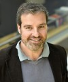
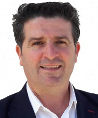

BIO³ está formado por investigadores de diferentes departamentos de la [Universidad de Granada](https://www.ugr.es) que comparten el compromiso con la investigación cuantitativa en biociencias y salud pública.

------------------------------------------------------------------------

## Miembros Permanentes {.section-title}

::: {.members-grid}

```{=html}
<!-- ===================================================
     MIEMBRO 1 — Juan Manuel Melchor Rodríguez
     =================================================== -->
```

::: member-card
{width="150px" alt="Juan Manuel Melchor Rodríguez"}

### [Juan Manuel Melchor Rodríguez](https://www.ugr.es/personal/juan-manuel-melchor-rodriguez) {#miembro1}

::: member-role
Miembro Fundador · Coordinador
:::

::: member-dept
Departamento de Estadística e Investigación Operativa · Universidad de Granada
:::

::: member-bio
Juan Manuel Melchor es matemático especializado en modelización matemática de enfermedades infecciosas, dinámica de poblaciones y epidemiología matemática. Su investigación se centra en el desarrollo de modelos matemáticos para comprender la transmisión de enfermedades, evaluar intervenciones de salud pública y predecir la evolución de epidemias. Profesor en la Universidad de Granada, ha colaborado con instituciones nacionales e internacionales en proyectos relacionados con la epidemiología cuantitativa y la salud pública.
:::

::: member-tags
[Modelización Matemática]{.tag} [Epidemiología Matemática]{.tag} [EDOs]{.tag} [Python]{.tag}
:::

::: member-links
[Producción Científica UGR](https://produccioncientifica.ugr.es/investigadores/355249/detalle){.member-link}
:::
::::::::

```{=html}
<!-- ===================================================
     MIEMBRO 2 — Miguel Ángel Luque Fernández
     =================================================== -->
```

::: member-card
{width="150px" alt="Miguel Ángel Luque Fernández"}

### [Miguel Ángel Luque Fernández](https://www.ugr.es/personal/miguel-angel-luque-fernandez) {#miembro2}

::: member-role
Miembro Coordinador
:::

::: member-dept
Departamento de Estadística e Investigación Operativa · Universidad de Granada
:::

::: member-bio
Matemático Aplicado (Estadística), Epidemiólogo y Bioestadístico con especialización en inferencia causal, métodos semiparamétricos y análisis de supervivencia. Su investigación combina métodos cuantitativos avanzados con preguntas clínicas y de salud pública de alto impacto. Profesor de Estadística en la Universidad de Granada, es también Profesor Asociado Honorario por la London School of Hygiene & Tropical Medicine y fue Postdoctoral Fellow en la Harvard T.H. Chan School of Public Health y la Harvard Medical School, instituciones con las que mantiene colaboraciones activas.
:::

::: member-tags
[Epidemiología]{.tag} [Inferencia Causal]{.tag} [Bioestadística]{.tag} [Supervivencia]{.tag} [R / Stata]{.tag}
:::

::: member-links
[Producción Científica UGR](https://produccioncientifica.ugr.es/investigadores/356497/detalle){.member-link}
:::
::::::::

```{=html}
<!-- ===================================================
     MIEMBRO 3 — Miguel Ángel Montero Alonso
     =================================================== -->
```

::: member-card
{width="150px" alt="Miguel Ángel Montero Alonso"}

### [Miguel Ángel Montero Alonso](https://www.ugr.es/personal/miguel-angel-montero-alonso) {#miembro3}

::: member-role
Miembro Coordinador
:::

::: member-dept
Departamento de Estadística e Investigación Operativa · Universidad de Granada
:::

::: member-bio
Miguel Ángel Montero Alonso es matemático especializado en modelización matemática de enfermedades infecciosas, dinámica de poblaciones y epidemiología matemática. Su investigación se centra en el desarrollo de modelos matemáticos para comprender la transmisión de enfermedades, evaluar intervenciones de salud pública y predecir la evolución de epidemias. Profesor en la Universidad de Granada, ha colaborado con instituciones nacionales e internacionales en proyectos relacionados con la epidemiología cuantitativa y la salud pública.
:::

::: member-tags
[Epidemiología]{.tag} [Inferencia Causal]{.tag} [Bioestadística]{.tag} [Supervivencia]{.tag} [R / Stata]{.tag}
:::

::: member-links
[Producción Científica UGR](https://produccioncientifica.ugr.es/investigadores/356547/detalle){.member-link}
[Perfil UGR](https://www.ugr.es/personal/miguel-angel-montero-alonso){.member-link}
:::
::::::::

```{=html}
<!-- ===================================================
     MIEMBRO 4 — Oscar Sánchez Romero
     =================================================== -->
```

::: member-card
{width="150px" alt="Oscar Sánchez Romero"}

### [Oscar Sánchez Romero](http://www.ugr.es/~ossanche/) {#miembro4}

::: member-role
Miembro Coordinador
:::

::: member-dept
Departamento de Matemática Aplicada · Universidad de Granada
:::

::: member-bio
Oscar Sánchez es profesor asociado del Departamento de Matemáticas Aplicadas (DMA) de la Universidad de Granada (UGR). Tras varios contratos y estancias en la Universidad Carlos III de Madrid y la UGR, en 2003 presentó su tesis doctoral, que abordaba modelos matemáticos derivados de la teoría de semiconductores y la dinámica gravitacional. Desde entonces trabaja en el DMA de la UGR y ha colaborado con diversos centros de investigación, como la Universidad de París IX (CEREMADE), la Universidad Pompeu Fabra y el Centro de Biología Molecular Severo Ochoa, entre otros.

Su investigación se centra en las ecuaciones diferenciales, concretamente en su análisis y aplicaciones de modelización. Ha trabajado con una amplia variedad de ecuaciones matemáticas en diversos campos: ecuaciones diferenciales parciales hiperbólicas, operadores con flujo limitado, sistemas dinámicos basados en modelos cuánticos, sistemas cinéticos clásicos/relativistas y sistemas biológicos. Este trabajo requiere el uso de técnicas matemáticas muy diversas: optimización funcional no convexa, análisis cuantitativo de soluciones de ecuaciones diferenciales, límites de modelos discretos, sistemas dinámicos, análisis numérico, modelado matemático, etc. El carácter matemático de su trabajo se ha enriquecido gracias a la interacción con investigadores de otras áreas como la Astrofísica y la Biología. En consecuencia, sus publicaciones están indexadas en numerosas categorías, como Matemáticas, Matemáticas Aplicadas, Matemáticas Interdisciplinarias, Física Multidisciplinar, Mecánica, Física Matemática, Matemática Condensada y Biología. Todas sus publicaciones y preprints se publican regularmente en la página web de publicaciones del grupo de investigación sobre EDP en Teoría Cinética, Cinética Cuántica, Mecánica de Fluidos y Biología del Desarrollo, en el que participa. Recientemente, su interés se ha centrado en el desarrollo de herramientas matemáticas para el análisis de componentes galácticos y en el modelado de procesos morfogenéticos en el desarrollo embrionario.

Actualmente, sus actividades docentes se centran principalmente en las licenciaturas en Matemáticas y Biología y en el programa de maestría en Física y Matemáticas (FisyMat). Imparte clases de modelado matemático y métodos numéricos a nivel de pregrado y posgrado. Además, en los últimos años ha colaborado con escuelas y talleres internacionales de posgrado. Ha dirigido (o codirigido) una tesis doctoral y actualmente dirige otra.
:::

::: member-tags
[EDPs]{.tag} [Modelización Biomatemática]{.tag} [Ecuaciones evolutivas]{.tag} [Modelización génica]{.tag} [Python / Free Fem]{.tag}
:::

::: member-links
[Producción Científica UGR](https://produccioncientifica.ugr.es/investigadores/356874/detalle){.member-link}
:::
::::::::

```{=html}
<!-- ===================================================
     MIEMBRO 5 — Juan Calvo Yagüe
     =================================================== -->
```

::: member-card
{width="150px" alt="Juan Calvo Yagüe"}

### [Juan Calvo Yagüe](https://www.modelingnature.org/juan-calvo) {#miembro5}

::: member-role
Miembro Coordinador
:::

::: member-dept
Departamento de Matemática Aplicada · Universidad de Granada
:::

::: member-bio
Juan Calvo es Profesor Asociado del Departamento de Matemática Aplicada de la Universidad de Granada (UGR). Se doctoró en Matemáticas por la UGR en 2010. Ha sido becario postdoctoral Juan de la Cierva en la Universitat Pompeu Fabra y en el Centre de Recerca Matemàtica. En 2016 recibió el Premio Antonio Valle al joven investigador (Sociedad Española de Matemática Aplicada). Desde 2016 trabaja en la UGR.

Sus principales líneas de investigación se centran en el análisis de ecuaciones diferenciales parciales (EDP) y sus aplicaciones. Algunos de sus trabajos abordan ecuaciones parabólicas degeneradas como modelo de propagación finita en sistemas biológicos. Está particularmente interesado en las diversas familias de ondas viajeras singulares que surgen en este contexto. Juan Calvo también cuenta con experiencia en el análisis de modelos de EDP en teoría cinética y sus aplicaciones para describir escenarios relevantes tanto en Astrofísica como en Biología. Juan Calvo imparte clases de análisis numérico a nivel de pregrado. Su docencia en el máster se centra en modelos matemáticos para la comunicación celular.
:::

::: member-tags
[Modelos Matemáticos]{.tag} [Biología Matemática]{.tag} [EDPs]{.tag} [MATLAB / Python]{.tag}
:::

::: member-links
[Producción Científica UGR](https://produccioncientifica.ugr.es/investigadores/355530/detalle){.member-link}
:::
::::::::

:::

-----------------------------------------------------------------------

::: institutional-footer
[{width="120px" alt="Escudo de la Universidad de Granada"}](https://www.ugr.es)

{width="120px" alt="Logotipo de BIO³ BIOCUBO"}

¿Interesado en unirte a BIO³? Contacta con los coordinadores del grupo a través de la [Universidad de Granada](https://www.ugr.es).
:::
