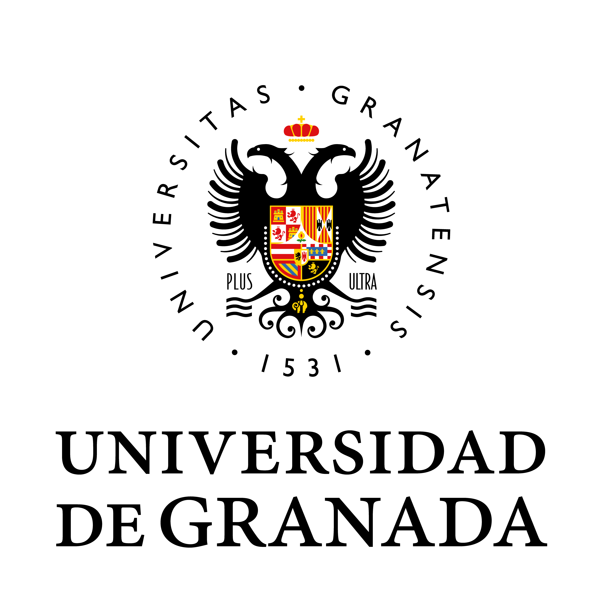

Los seminarios de BIO³ se celebran **trimestralmente** y están abiertos a toda la comunidad científica. Cada sesión combina una ponencia científica con tiempo para debate y networking. Los vídeos de las sesiones pasadas quedan disponibles en esta página.

---

## Próximas Sesiones {.section-title}

::: {.seminar-card .upcoming}
::: {.seminar-date}
Junio 2026 · Trimestre II · 2026
:::
### Sesión Inaugural: Presentación de BIO³ e Inferencia Causal Moderna [Próximamente]{.badge-upcoming}

::: {.seminar-speaker}
Ponente: Miguel Ángel Luque Fernández · Coordinador BIO³
:::

::: {.seminar-abstract}
Sesión de apertura del grupo BIO³ BIOCUBO. Se presentará la misión, los objetivos y las líneas de investigación del grupo, seguida de una charla sobre métodos causales modernos: *Conformal Causal Inference* y sus aplicaciones en bioestadística y epidemiología.
:::

**Lugar:** Por confirmar · Universidad de Granada
**Hora:** Por confirmar
**Registro:** Abierto a toda la comunidad UGR
:::

---

::: {.seminar-card .upcoming}
::: {.seminar-date}
Septiembre 2026 · Trimestre III · 2026
:::
### Modelos Matemáticos en Epidemiología de Enfermedades Infecciosas [Próximamente]{.badge-upcoming}

::: {.seminar-speaker}
Ponente: Por confirmar · Departamento de Matemática Aplicada, UGR
:::

::: {.seminar-abstract}
Segunda sesión del ciclo BIO³. Se abordarán los fundamentos de los modelos compartimentales (SIR, SEIR) y sus extensiones modernas, con aplicaciones a la pandemia de COVID-19 y otras enfermedades infecciosas emergentes.
:::

**Lugar:** Por confirmar · Universidad de Granada
**Hora:** Por confirmar
:::

---

::: {.seminar-card .upcoming}
::: {.seminar-date}
Diciembre 2026 · Trimestre IV · 2026
:::
### Análisis de Datos Ómicos: del Genoma al Fenotipo [Próximamente]{.badge-upcoming}

::: {.seminar-speaker}
Ponente: Por confirmar · Departamento de Bioquímica y Biología Molecular, UGR
:::

::: {.seminar-abstract}
Tercera sesión del ciclo anual. Introducción al análisis estadístico de datos genómicos, transcriptómicos y proteómicos. Métodos de reducción de dimensionalidad, corrección de múltiples comparaciones y pipelines de análisis reproducible con R/Bioconductor.
:::

**Lugar:** Por confirmar · Universidad de Granada
:::

---

## Sesiones Pasadas {.section-title}

> Las sesiones inaugurales de BIO³ comenzarán en 2026. Esta sección se irá completando con los vídeos y materiales de cada sesión.

<!-- ===================================================
     PLANTILLA PARA SESIÓN PASADA — copiar y completar
     =================================================== -->
<!--
::: {.seminar-card}
::: {.seminar-date}
[MES] [AÑO] · Trimestre [N]
:::
### [TÍTULO DE LA CHARLA]

::: {.seminar-speaker}
Ponente: [Nombre Apellido] · [Afiliación]
:::

::: {.seminar-abstract}
[Resumen de la charla, 2-4 frases describiendo el contenido y las conclusiones principales.]
:::

[▶ Ver vídeo](URL_VIDEO){.btn-video}
[📄 Descargar slides](URL_SLIDES)
:::
-->

---

## Formato de los Seminarios {.section-title}

| Elemento       | Detalle                              |
|----------------|--------------------------------------|
| **Frecuencia** | Trimestral (Marzo, Junio, Sept., Dic.) |
| **Duración**   | 60–90 minutos (charla + debate)      |
| **Modalidad**  | Presencial + retransmisión online    |
| **Vídeos**     | Publicados en esta página tras la sesión |
| **Idioma**     | Español / Inglés                     |
| **Acceso**     | Libre y abierto a toda la comunidad  |

---

::: {.institutional-footer}
[{width="120px"}](https://www.ugr.es)

Para proponer una ponencia o para más información, contacta con el grupo a través de la [Universidad de Granada](https://www.ugr.es).
:::
