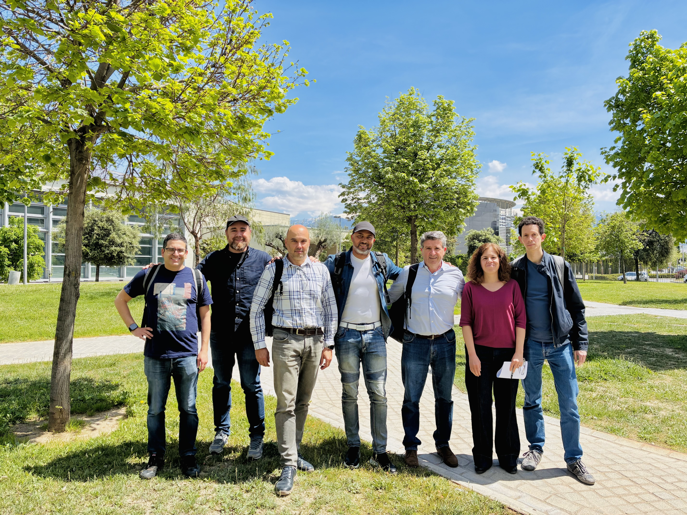
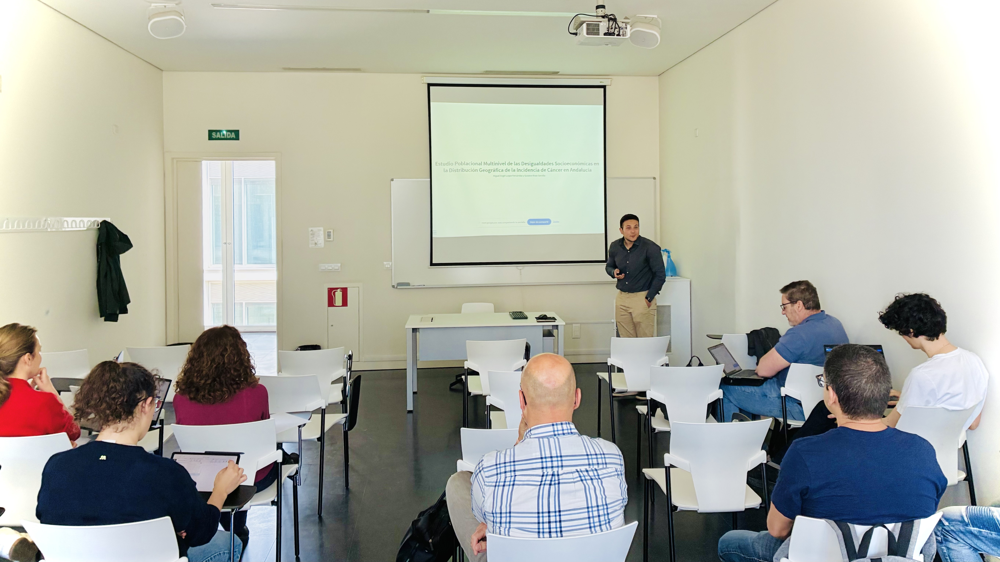
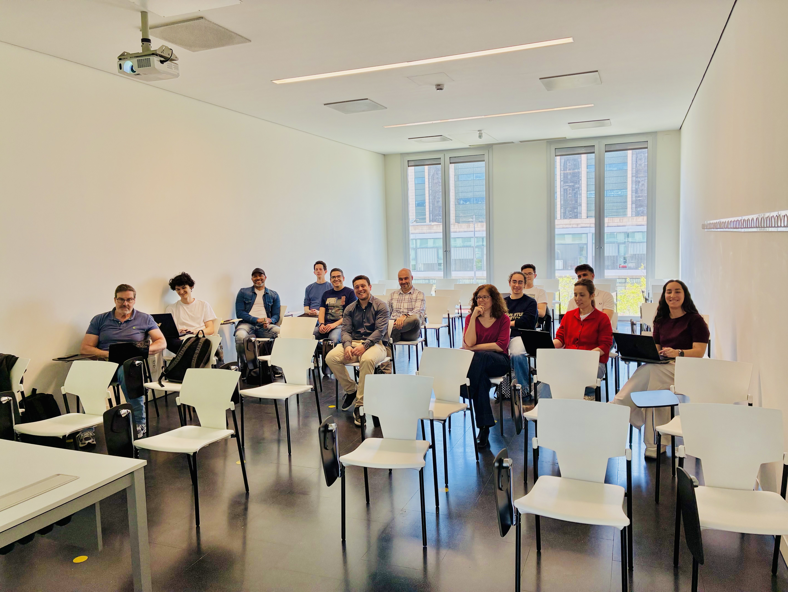

Los seminarios de BIO³ se celebran **trimestralmente** y están abiertos a toda la comunidad científica. Cada sesión combina una ponencia científica con tiempo para debate y networking. Los vídeos de las sesiones pasadas quedan disponibles en esta página.

------------------------------------------------------------------------

::: {.photo-grid}
{alt="Componentes del grupo BIO³ reunidos en el campus de la Universidad de Granada"}

{alt="Ponente impartiendo una sesión del seminario BIO³ ante la audiencia"}

{alt="Asistentes a un seminario BIO³ en una aula de la Universidad de Granada"}
:::

------------------------------------------------------------------------

## Próximas Sesiones {.section-title}

:::::: {.seminar-card .upcoming}
::: seminar-date
Junio 2026 · Trimestre II
:::

### Sesión I: Inferencia Causal Conformal en Bioestadística [Próximamente]{.badge-upcoming}

::: seminar-speaker
Ponente: Por confirmar · BIO³ BIOCUBO · UGR
:::

::: seminar-abstract
Sesión de apertura del grupo BIO³ BIOCUBO. Se presentará la misión, los objetivos y las líneas de investigación del grupo, seguida de una charla sobre métodos causales modernos: *Conformal Causal Inference* y sus aplicaciones en bioestadística y epidemiología.
:::

::: {.seminar-meta}
**Lugar:** Por confirmar · Universidad de Granada

**Hora:** Por confirmar

**Registro:** Abierto a toda la comunidad UGR
:::
::::::

------------------------------------------------------------------------

:::::: {.seminar-card .upcoming}
::: seminar-date
Septiembre 2026 · Trimestre III
:::

### Modelos Matemáticos en Epidemiología de Enfermedades Infecciosas [Próximamente]{.badge-upcoming}

::: seminar-speaker
Ponente: Por confirmar · Departamento de Matemática Aplicada, UGR
:::

::: seminar-abstract
Segunda sesión del ciclo BIO³. Se abordarán los fundamentos de los modelos compartimentales (SIR, SEIR) y sus extensiones modernas, con aplicaciones a la pandemia de COVID-19 y otras enfermedades infecciosas emergentes.
:::

::: {.seminar-meta}
**Lugar:** Por confirmar · Universidad de Granada

**Hora:** Por confirmar
:::
::::::

------------------------------------------------------------------------

:::::: {.seminar-card .upcoming}
::: seminar-date
Diciembre 2026 · Trimestre IV
:::

### Análisis de Datos Ómicos: del Genoma al Fenotipo [Próximamente]{.badge-upcoming}

::: seminar-speaker
Ponente: Por confirmar · Departamento de Bioquímica y Biología Molecular, UGR
:::

::: seminar-abstract
Tercera sesión del ciclo anual. Introducción al análisis estadístico de datos genómicos, transcriptómicos y proteómicos. Métodos de reducción de dimensionalidad, corrección de múltiples comparaciones y pipelines de análisis reproducible con R/Bioconductor.
:::

::: {.seminar-meta}
**Lugar:** Por confirmar · Universidad de Granada
:::
::::::

------------------------------------------------------------------------

## Sesiones Pasadas {.section-title}

:::::: {.seminar-card .past}
::: seminar-date
Febrero 2025 · Trimestre I
:::

### Tutorial de Inferencia Causal [13-2-2025]{.badge-date}

::: seminar-speaker
Ponente: Miguel Ángel Luque · Departamento de Estadística e Investigación Operativa, UGR
:::

::: seminar-abstract
Este tutorial aborda el desafío del sesgo de confusión en estudios observacionales médicos, donde la aleatorización no es factible y los ajustes tradicionales suelen ser insuficientes por errores de especificación. Los autores presentan una guía práctica y evolutiva sobre la implementación computacional de estimadores de inferencia causal (desde la fórmula-G y la probabilidad inversa ponderada hasta métodos doblemente robustos y adaptativos), proporcionando además código reproducible en Stata, R y Python. El objetivo es cerrar la brecha entre los avances teóricos recientes y su aplicación clínica, ilustrando el proceso con un ejemplo real de medicina de cuidados intensivos para facilitar su adopción por investigadores aplicados.
:::

::: {.seminar-meta}
**Seminario de Bioestadística:** Facultad de Medicina · Universidad de Granada
:::
::::::

------------------------------------------------------------------------

:::::: {.seminar-card .past}
::: seminar-date
Febrero 2025 · Trimestre I
:::

### La Forma de una ola epidémica [13-2-2025]{.badge-date}

::: seminar-speaker
Ponente: Juan Campos · Departamento de Matemática Aplicada, UGR
:::

::: seminar-abstract
Se presenta un novedoso marco matemático basado en el modelo de Kermack-McKendrick que permite extraer parámetros epidemiológicos esenciales a partir de la geometría de las ondas epidémicas. A través de la introducción de tres indicadores clave (fracción de endemicidad, severidad y asimetría) junto con una definición refinada del número de reproducción básico, se demuestran que es posible parametrizar el modelo de forma sencilla basándose en la asimetría de los datos reales. Esta metodología destaca por su practicidad para la toma de decisiones en salud pública, ya que prescinde de herramientas matemáticas complejas y muestra una alta precisión al compararse con datos de diversos casos de estudio.
:::
::::::

------------------------------------------------------------------------

:::::: {.seminar-card .past}
::: seminar-date
Diciembre 2024 · Trimestre II
:::

### Desarrollo de estándares de crecimiento fetal de la población de Granada [17-12-2024]{.badge-date}

::: seminar-speaker
Ponente: José Alejandro Ávila · Hospital Clínico San Cecilio
:::
::::::

------------------------------------------------------------------------

:::::: {.seminar-card .past}
::: seminar-date
Noviembre 2024 · Trimestre II
:::

### COVID-19 y Causalidad [17-11-2024]{.badge-date}

::: seminar-speaker
Ponente: Cristóbal M. Rodríguez Leal · Facultad de Estudios Estadísticos, UCM
:::
::::::

------------------------------------------------------------------------

:::::: {.seminar-card .past}
::: seminar-date
Septiembre 2024 · Trimestre I
:::

### Transcriptional control modelling in genetics [12-9-2024]{.badge-date}

::: seminar-speaker
Ponente: Oscar Sánchez · Departamento de Matemática Aplicada, UGR
:::
::::::

------------------------------------------------------------------------

:::::: {.seminar-card .past}
::: seminar-date
Septiembre 2024 · Trimestre I
:::

### Líneas de Investigación en la Cohorte GRAMO [12-9-2024]{.badge-date}

::: seminar-speaker
Ponente: Juan Pedro Arrebola · Departamento de Medicina Preventiva y Salud Pública, UGR
:::
::::::

------------------------------------------------------------------------

:::::: {.seminar-card .past}
::: seminar-date
Septiembre 2024 · Trimestre I
:::

### Presentación del seminario BIO3 y Redes KAN [12-9-2024]{.badge-date}

::: seminar-speaker
Ponente: Juan Melchor · Departamento de Estadística e Investigación Operativa, UGR
:::
::::::

> Las sesiones inaugurales de BIO³ comenzaron en 2024. Esta sección se irá completando con los vídeos y materiales de cada sesión.

```{=html}
<!-- ===================================================
     PLANTILLA PARA SESIÓN PASADA — copiar y completar
     =================================================== -->
```

```{=html}
<!--
::: {.seminar-card}
::: {.seminar-date}
[MES] [AÑO] · Trimestre [N]
:::
### [TÍTULO DE LA CHARLA]

::: {.seminar-speaker}
Ponente: [Nombre Apellido] · [Afiliación]
:::

::: {.seminar-abstract}
[Resumen de la charla, 2-4 frases describiendo el contenido y las conclusiones principales.]
:::

[▶ Ver vídeo](URL_VIDEO){.btn-video}
[📄 Descargar slides](URL_SLIDES)
:::
-->
```

------------------------------------------------------------------------

## Formato de los Seminarios {.section-title}

| Elemento       | Detalle                                  |
|----------------|------------------------------------------|
| **Frecuencia** | Trimestral (Marzo, Junio, Sept., Dic.)   |
| **Duración**   | 60–90 minutos (charla + debate)          |
| **Modalidad**  | Presencial + retransmisión online        |
| **Vídeos**     | Publicados en esta página tras la sesión |
| **Idioma**     | Español / Inglés                         |
| **Acceso**     | Libre y abierto a toda la comunidad      |

------------------------------------------------------------------------

::: institutional-footer
[{width="120px" alt="Escudo de la Universidad de Granada"}](https://www.ugr.es)

Para proponer una ponencia o para más información, contacta con el grupo a través de la [Universidad de Granada](https://www.ugr.es).
:::
